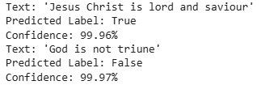

# AI-knows-Christianity
This is a project that uses AI to check if a sentence concerning christianity is true or not. 
This was created using the BERT model and 10000 sentences dataset
# Result of the test for the AI

